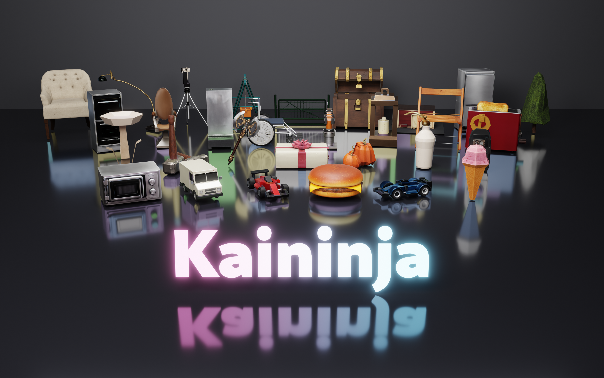

<h1 align="center">KaiNinja: Extending Native 3D Generators to the Part Level</h1>

<p align="center"><a href="https://alayalab.ai/"><b>Alaya Lab</b></a></p>

<p align="center">
  <a href="https://alaya-lab.github.io/KaiNinja/"></a>
  <a href="https://arxiv.org/abs/2609.15659"></a>
</p>

<p align="center">
  
</p>

<p align="center">
  <a href="https://alaya-lab.github.io/KaiNinja/"></a>
</p>

## 📰 News

- **[2026-09-15]** Paper released on [arXiv](https://arxiv.org/abs/2609.15659).
- **[2026-09-15]** [Project page](https://alaya-lab.github.io/KaiNinja/) released.

## 🚀 Release Roadmap

- [x] Project page
- [x] Technical report — [arXiv](https://arxiv.org/abs/2609.15659)
- [ ] Inference code
- [ ] Pretrained weights

## BibTeX

```bibtex
@misc{yu2026kaininja,
  title   = {KaiNinja: Extending Native 3D Generators to the Part Level},
  author  = {Yu, Ruihan and Fu, Lian and Niu, Muyao and Huang, Zheng-hui and Tsai, Yu-Ju and Kuno, Sho and Lan, Fengbo and Yu, Yonghao and Wu, Erwin and Yang, Ming-Hsuan and Zhang, Kaipeng and Wang, Zhixiang},
  year    = {2026},
  eprint  = {2609.15659},
  archivePrefix = {arXiv},
  primaryClass  = {cs.CV}
}
```
