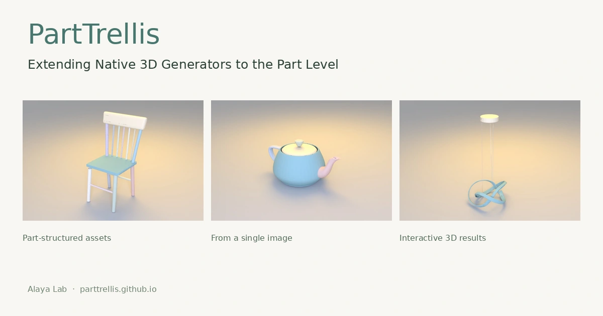

<div align="center">

# KaiNinja: Extending Native 3D Generators to the Part Level

[**Project Page**](https://alaya-lab.github.io/KaiNinja/) | [**Paper**](https://alaya-lab.github.io/KaiNinja/assets/paper/kaininja.pdf)



</div>

Code and pretrained models are being prepared for release.

## BibTeX

```bibtex
@misc{yu2026kaininja,
  title   = {KaiNinja: Extending Native 3D Generators to the Part Level},
  author  = {Yu, Ruihan and Fu, Lian and Niu, Muyao and Huang, Zheng-hui and Tsai, Yu-Ju and Kuno, Sho and Lan, Fengbo and Yu, Yonghao and Wu, Erwin and Yang, Ming-Hsuan and Zhang, Kaipeng and Wang, Zhixiang},
  note    = {Manuscript},
  year    = {2026}
}
```
